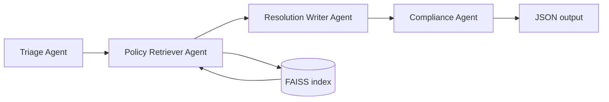

# E-commerce Support Resolution Agent (Multi-Agent RAG)

Production-style reference implementation: **FastAPI** backend, **Streamlit** frontend, **LangChain** orchestration, **Groq** LLM, **HuggingFace** embeddings, **FAISS** vector store, and **strict JSON** outputs with citation and compliance gates.

## Architecture overview



1. **Triage Agent** classifies the ticket (`refund` / `shipping` / `payment` / `promo` / `fraud` / `other`), emits confidence, missing-field hints, and up to **three** clarifying questions.
2. **Policy Retriever Agent** embeds the ticket+category query and pulls **top‑k** chunks from **FAISS**. Each chunk carries **`document_name`** and **`chunk_id`** (for example `refund_policy_chunk_2`, derived from the policy filename stem).
3. **Resolution Writer Agent** calls **Groq** with a **retrieved-context-only** prompt. If evidence is below minimum or missing, it **escalates** rather than inventing policy.
4. **Compliance Agent** validates **citations ⊆ retrieved chunk ids**, checks unsupported claims relative to retrieved text, and **rewrites or escalates** when needed.

No-hallucination controls:

- Writer system prompt: **only** use retrieved chunks; cite chunk ids; **escalate** if not covered.
- **Minimum evidence**: if retrieval does not meet `min_evidence_chunks` (default `1`), writer returns **escalate**.
- Writer strips any citation not present in retrieval; non‑escalate decisions without valid citations are **forced to escalate**.
- Compliance performs a **second Groq pass** plus deterministic citation checks.

## Agent roles (file map)

| Agent | File |
|------|------|
| Triage | `agents/triage_agent.py` |
| Policy Retriever | `agents/policy_retriever_agent.py` + `rag/retriever.py` |
| Resolution Writer | `agents/resolution_writer_agent.py` |
| Compliance | `agents/compliance_agent.py` |
| Orchestration | `agents/workflow.py` |

## RAG pipeline

Implemented in `rag/ingest.py`, `rag/pipeline.py`, `rag/embeddings.py`, `rag/retriever.py`:

1. **Ingest** `.txt` / `.md` from `data/policies/`.
2. **Cleaning** (normalize whitespace) in `rag/pipeline.py`.
3. **Chunking** with `RecursiveCharacterTextSplitter` — **`chunk_size=500`**, **`overlap=50`** (configurable via `.env`).
4. **Embeddings** with HuggingFace **`sentence-transformers/all-MiniLM-L6-v2`** (CPU, normalized).
5. **FAISS** index persisted under `data/faiss_index/`.
6. **Retriever** returns top‑k with **document name** + **chunk id** metadata.

### Chunking decision: why 500 / 50

- **500 characters** balances *granularity vs context*: long enough for a coherent rule paragraph (condition + exception), short enough that a single embedding vector is not polluted by unrelated sections.
- **50-character overlap** avoids *cutting* a sentence or bullet across boundaries so retrieval still finds either adjacent chunk for borderline queries (addresses boundary fragmentation in policy corpora).

## Policy corpus

- **17+** text files under `data/policies/` (including `generated_policy_segments_volume_1.txt` to extend retrieval coverage).
- Combined size is **~28k+ words**, exceeding the **~25,000 words** guideline while keeping named policies realistic and adding procedural segments for breadth.

Topics covered include: **returns & refunds (with exceptions)**, **cancellations**, **shipping & delivery**, **promotions**, **disputes (damaged/missing)**, **payment**, **fraud**, **international**, **subscriptions/digital**, **gift cards**, **warranty**, **loyalty**, **marketplace**, **privacy**, and a **regulatory supplement**.

## Evaluation

- **20** scenarios in `evaluation/test_cases.json`:
  - **8** normal
  - **6** exception-heavy
  - **3** conflict
  - **3** not-in-policy (expected escalation)
- **Script**: `evaluation/run_evaluation.py` writes `evaluation/evaluation_report.json`.

Metrics:

- **Citation coverage rate**: fraction of output citations that exist in retrieved chunk ids (empty citations on **escalate** treated as valid when escalation is appropriate).
- **Unsupported claim rate (proxy)**: fraction of runs where `compliance.passed` is `false` (LLM-based compliance + deterministic citation checks).
- **Escalation correctness**: match `decision == "escalate"` to `expected_escalation` when provided.

> **Note:** Metrics depend on **Groq** outputs and retrieval; re-run after changing models or prompts. Initial runs may show non‑zero unsupported proxy when the compliance model flags borderline wording.

### Example evaluation results (illustrative)

After `POST /ingest` and with a valid `GROQ_API_KEY`, a typical local run might show:

- Citation coverage rate: **~0.85–1.00** (depends on model adherence)
- Unsupported claim rate: **~0.10–0.35** (compliance strictness)
- Escalation correctness: **~0.80–1.00** on the fixed test set

Replace this subsection with your machine’s `evaluation_report.json` numbers for submissions.

### Failure cases & improvements

- **Retrieval misses the right chunk**: increase `TOP_K`, try a stronger embedding model, or add query expansion (category + entities).
- **Over‑escalation on edge merges**: add a light reranker (cross-encoder) on top of FAISS hits.
- **Compliance false positives**: tighten compliance prompt or add deterministic entailment checks for critical claims.
- **Latency**: cache embeddings for static corpora; use GPU for embeddings if available.
- **Single-line generated corpus**: acceptable for retrieval; optionally reflow for human editing.

## Setup

### 1. Python environment

```bash
cd ASSESSMENT_2_Cursor
python -m venv .venv
.venv\Scripts\activate
pip install -r requirements.txt
```

### 2. Environment variables

Copy `.env.example` to `.env` and set **`GROQ_API_KEY`**.

```bash
copy .env.example .env
```

### 3. Build the FAISS index

```bash
uvicorn backend.main:app --reload
```

Then:

```http
POST http://127.0.0.1:8000/ingest
```

Or programmatically:

```python
from rag.ingest import ingest_policies
ingest_policies()
```

### 4. Run the API

```bash
uvicorn backend.main:app --reload --host 127.0.0.1 --port 8000
```

### 5. Run Streamlit

```bash
streamlit run frontend/app.py
```

### 6. Run evaluation

```bash
python evaluation/run_evaluation.py
```

## API

### `POST /ingest`

Builds / refreshes FAISS under `data/faiss_index/`.

### `POST /query`

Body:

```json
{
  "ticket": "Customer message...",
  "order_context": {
    "order_date": "2026-01-10",
    "delivery_date": "2026-01-14",
    "item_category": "electronics",
    "fulfillment_type": "standard",
    "shipping_region": "domestic",
    "order_status": "delivered",
    "payment_method": "credit_card"
  },
  "top_k": 5
}
```

Response JSON keys:

`classification`, `confidence`, `clarifying_questions`, `decision`, `rationale`, `citations`, `customer_response`, `internal_notes`.

## Project structure

```
backend/           # FastAPI app
agents/            # Triage, retriever wrapper, writer, compliance, workflow
rag/               # Ingestion, chunking, embeddings, FAISS load/save, retrieval
data/policies/     # Policy corpus (.txt/.md)
data/faiss_index/  # Generated FAISS store (after ingest)
frontend/          # Streamlit UI
evaluation/        # test_cases.json + run_evaluation.py + report output
utils/             # Settings, schemas, JSON helpers
.env               # Your secrets (create from .env.example)
requirements.txt
README.md
```

## License / disclaimer

Example policies are synthetic training text for academic / portfolio use, not legal advice.
